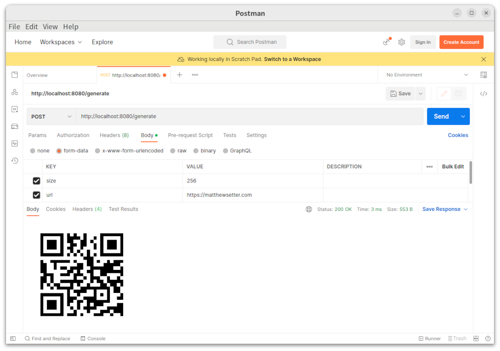

# Prerequisites
To follow along with the tutorial, you don't need much, just the following things:

- Go (a recent version, or the latest, 1.20.5)
- Your preferred text editor or IDE. My recommendation is Visual Studio Code with the Go extension
- A smartphone with a QR code scanner (which most of them should have, these days)

# How will the application work?
Before we dive in and start writing Go code, here's what the code will do. The application will be a simplistic web service with one endpoint (/generate) that supports POST requests. Requests to the endpoint will require at least two POST request parameters:

- size: This is an integer that sets the width and height of the QR code
  
- content: This is a string that provides the QR code's content. For the sake of simplicity, the tutorial will use a URL, but you could use almost anything, so long as it's less than 7,089 characters
  
An optional, third, parameter (watermark) will also be supported in the later version of the code. This will be a PNG image that will be overlaid over the centre of the generated QR code.

# Create the project directory
The first thing to do is to create the project directory. It's going to be pretty uncomplicated, just having the following structure:
```.
    ├── data
    └── uploads
```
# Get started

Add module support, by running the following command:
```bash
go mod init qr-code-generator
```
Now, it's time to create the core code. It won't do much, but will at least provide a route that can be requested. In the top-level project directory, create a new file named main.go. Then, in that file, paste the following code.
```go
package main

import "net/http"

func handleRequest(writer http.ResponseWriter, request *http.Request) {

}

func main() {
    http.HandleFunc("/generate", handleRequest)
    http.ListenAndServe(":8080", nil)
}
```
The main() function uses the net/http package to register a route (/generate) which is handled with the handleRequest() function, and starts an HTTP server listening on port 8080.

The handleRequest() function doesn't do anything, so when calling it only an HTTP 200 response will be returned.

While the application does almost nothing, it's still worth testing that it works. Before you can do that though, start the application by running the following command.
```bash
go run main.go
```
Then, make a request to the application by running the following curl command in a new terminal session.
```bash
curl -i -X POST http://localhost:8080/generate
```
Now, it's time to add the ability to generate the QR code. Start by adding the following code after the import list in main.go.
```go
type simpleQRCode struct {
    Content string
    Size        int
}

func (code *simpleQRCode) Generate() ([]byte, error) {
    qrCode, err := qrcode.Encode(code.Content, qrcode.Medium, code.Size)
    if err != nil {
        return nil, fmt.Errorf("could not generate a QR code: %v", err)
    }
    return qrCode, nil
}
```
The code starts off by adding a custom type, simpleQRCode. It has two properties, Content and Size, which contain the QR code's contents and size respectively.

simpleQRCode has one method, Generate(), which generates a QR code using Content and Size. If successful, it returns the QR code's data, otherwise, it returns an error message.

Now, update the handleRequest() function in main.go to match the following code.
```go
func handleRequest(writer http.ResponseWriter, request *http.Request) {
    request.ParseMultipartForm(10 << 20)
    var size, content string = request.FormValue("size"), request.FormValue("content")
    var codeData []byte

    writer.Header().Set("Content-Type", "application/json")

    if content == "" {
        writer.WriteHeader(400)
        json.NewEncoder(writer).Encode(
            "Could not determine the desired QR code content.",
        )
        return
    }

    qrCodeSize, err := strconv.Atoi(size)
    if err != nil || size == "" {
        writer.WriteHeader(400)
        json.NewEncoder(writer).Encode("Could not determine the desired QR code size.")
        return
    }

    qrCode := simpleQRCode{Content: content, Size: qrCodeSize}
    codeData, err = qrCode.Generate()
    if err != nil {
        writer.WriteHeader(400)
        json.NewEncoder(writer).Encode(
            fmt.Sprintf("Could not generate QR code. %v", err),
        )
        return
    }

    writer.Header().Set("Content-Type", "image/png")
    writer.Write(codeData)
}
```
To accommodate the new packages used in the revised code, update the imports list at the top of main.go to match the following.
```go
import (
    "encoding/json"
    "fmt"
    "net/http"
    "strconv"

    qrcode "github.com/skip2/go-qrcode"
)
```
Then, add the go qrcode package by running the following command.
```bash
go get github.com/skip2/go-qrcode
```
Run the following curl command in the second terminal session
```bash
curl -X POST \
    --form "size=256" \
    --form "content=https://twilio.com" \
    --output data/qrcode.png \
    http://localhost:8080/generate
```
After it completes, if you open data/qrcode.png you should see a QR code similar to the example below.



See the error messages
If you'd like to see the error messages, run one or both of the following commands.

```bash
curl -X POST --form "content=https://twilio.com" http://localhost:8080/generate
curl -X POST --form "size=256" http://localhost:8080/generate
```
Running the first command will return:
```json
{"error":"Could not determine the desired QR code size."}
```
Running the second will return the following
```json
{"error":"Could not determine the desired QR code content."}
```
Now for part two, adding a watermark to the QR code. Add the following code before the definition of simpleQRCode method in main.go.
```Go
func uploadFile(file multipart.File) ([]byte, error) {
    buf := bytes.NewBuffer(nil)
    if _, err := io.Copy(buf, file); err != nil {
        return nil, fmt.Errorf("could not upload file. %v", err)
    }

    return buf.Bytes(), nil
}

func resizeWatermark(watermark io.Reader, width uint) ([]byte, error) {
    decodedImage, err := png.Decode(watermark)
    if err != nil {
        return nil, fmt.Errorf("could not decode watermark image: %v", err)
    }

    m := resize.Resize(width, 0, decodedImage, resize.Lanczos3)
    resized := bytes.NewBuffer(nil)
    png.Encode(resized, m)

    return resized.Bytes(), nil
}
```
Two methods are defined: uploadFile and resizeWatermark.

uploadFile takes a multipart.File object, retrieved in an updated version of handleRequest shortly, writes it to memory, and returns the data. In an earlier version of the code, the file was stored on the filesystem, but writing it to memory instead makes it easier and more performant.

resizeWatermark resizes the uploaded image so that it can be overlaid on the QR code. It needs to be small enough so that it doesn't obscure too much of the QR code, such that it cannot be used.

Now, add the following code after the Generate() method in main.go.
```Go
func (code *simpleQRCode) GenerateWithWatermark(watermark []byte) ([]byte, error) {
    qrCode, err := code.Generate()
    if err != nil {
        return nil, err
    }

    qrCode, err = code.addWatermark(qrCode, watermark)
    if err != nil {
        return nil, fmt.Errorf("could not add watermark to QR code: %v", err)
    }

    return qrCode, nil
}

func (code *simpleQRCode) addWatermark(qrCode []byte, watermarkData []byte) ([]byte, error) {
    qrCodeData, err := png.Decode(bytes.NewBuffer(qrCode))
    if err != nil {
        return nil, fmt.Errorf("could not decode QR code: %v", err)
    }

    watermarkWidth := uint(float64(qrCodeData.Bounds().Dx())*0.25)
    watermark, err := resizeWatermark(bytes.NewBuffer(watermarkData), watermarkWidth)
    if err != nil {
        return nil, fmt.Errorf("Could not resize the watermark image.", err)
    }

    watermarkImage, err := png.Decode(bytes.NewBuffer(watermark))
    if err != nil {
        return nil, fmt.Errorf("could not decode watermark: %v", err)
    }

    var halfQrCodeWidth, halfWatermarkWidth int = qrCodeData.Bounds().Dx() / 2, watermarkImage.Bounds().Dx() / 2
    offset := image.Pt(
        halfQrCodeWidth - halfWatermarkWidth,
        halfQrCodeWidth - halfWatermarkWidth,
    )

    watermarkImageBounds := qrCodeData.Bounds()
    m := image.NewRGBA(watermarkImageBounds)

    draw.Draw(m, watermarkImageBounds, qrCodeData, image.Point{}, draw.Src)
    draw.Draw(
        m,
        watermarkImage.Bounds().Add(offset),
        watermarkImage,
        image.Point{},
        draw.Over,
    )

    watermarkedQRCode := bytes.NewBuffer(nil)
    png.Encode(watermarkedQRCode, m)

    return watermarkedQRCode.Bytes(), nil
}
```
The code adds two methods to simpleQRCode: GenerateWithWatermark() and addWatermark(). GenerateWithWatermark:

Calls Generate() to generate and return the QR code data

This data is then passed with the watermark image data to addWatermark(). This function overlays the watermark, resized to no more than a quarter of the width and height of the QR code, on the centre of the QR code

The watermarked QR code data is then returned

The code's a little limited in that it only supports PNG files. But for the sake of a simple example, it doesn't support other image file formats.

Next, update handleRequest() with the following code.
```Go
func handleRequest(writer http.ResponseWriter, request *http.Request) {
    request.ParseMultipartForm(10 << 20)
    var size, content string = request.FormValue("size"), request.FormValue("content")
    var codeData []byte

    if content == "" {
        writer.WriteHeader(400)
        json.NewEncoder(writer).Encode(
            "Could not determine the desired QR code content.",
        )
        return
    }

    qrCodeSize, err := strconv.Atoi(size)
    if err != nil || size == "" {
        writer.WriteHeader(400)
        json.NewEncoder(writer).Encode(
            "Could not determine the desired QR code size.",
        )
        return
    }

    qrCode := simpleQRCode{Content: content, Size: qrCodeSize}

    watermarkFile, _, err := request.FormFile("watermark")
    if err != nil && errors.Is(err, http.ErrMissingFile) {
        codeData, err = qrCode.Generate()
        if err != nil {
            writer.WriteHeader(400)
            json.NewEncoder(writer).Encode(
                fmt.Sprintf("Could not generate QR code. %v", err),
            )
            return
        }
        writer.Header().Add("Content-Type", "image/png")
        writer.Write(codeData)
        return
    }

    watermark, err := uploadFile(watermarkFile)
    if err != nil {
        writer.WriteHeader(400)
        json.NewEncoder(writer).Encode(
            fmt.Sprint("Could not upload the watermark image.", err),
        )
        return
    }

    contentType := http.DetectContentType(watermark)
    if err != nil {
        writer.WriteHeader(400)
        json.NewEncoder(writer).Encode(
            fmt.Sprintf(
                "Provided watermark image is a %s not a PNG. %v.", err, contentType,
            ),
        )
        return
    }

    codeData, err = qrCode.GenerateWithWatermark(watermark)
    if err != nil {
        writer.WriteHeader(400)
        json.NewEncoder(writer).Encode(
                fmt.Sprintf(
                    "Could not generate QR code with the watermark image. %v", err,
                ),
        )
        return
    }

    writer.Header().Set("Content-Type", "image/png")
    writer.Write(codeData)
}
```
Update the imports list, to match the following.
```Go
import (
    "bytes"
    "encoding/json"
    "fmt"
    "image"
    "image/draw"
    "image/png"
    "io"
    "mime/multipart"
    "net/http"
    "strconv"

    "github.com/nfnt/resize"
    qrcode "github.com/skip2/go-qrcode"
)
```
The revised code uses the nfnt/resize package. Add it to the project by running the following command.

```bash
go get github.com/nfnt/resize
```
Now, it's time to test the code and generate a QR code with an overlaid image. Again, before doing so, restart the application.

Then, if you prefer curl, run the following command.
```bash
curl -X POST \
    --form "size=256" \
    --form "content=https://matthewsetter.com" \
    --form "watermark=@data/twilio-logo.png" \
    --output data/qrcode.png \
    http://localhost:8080/generate
```

If you open data/qrcode.png, you should see a QR code similar to the example below.

